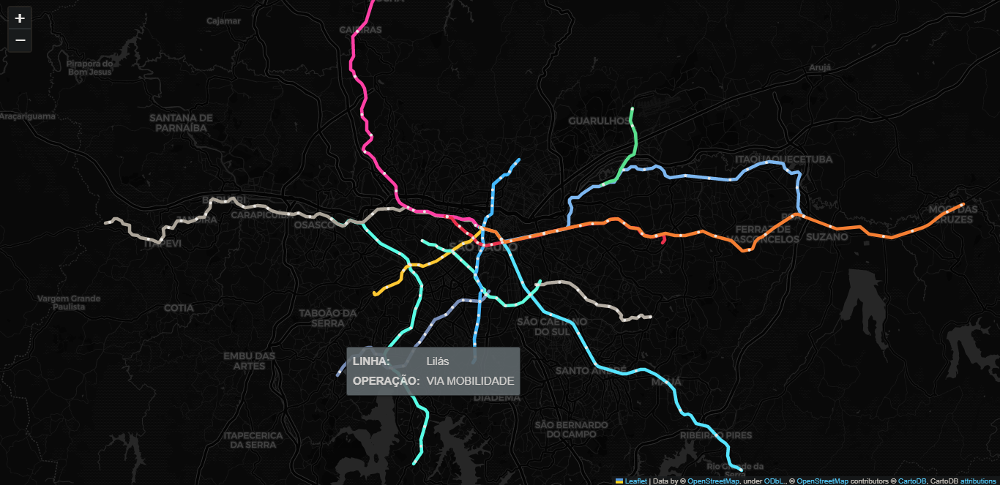

# Data Analysis and Visualization Project
## 🚇 Map of São Paulo's Train and Subway Lines and Stations
 [Medium Article: "Plotando um mapa interativo com informações do metrô de São Paulo usando Python"](https://medium.com/@liviaalvzs/plotando-um-mapa-interativo-com-informa%C3%A7%C3%B5es-do-metr%C3%B4-de-s%C3%A3o-paulo-usando-python-b0470d8d0b10)

[Working project in your browser here](https://liviaalvzs.github.io/metro-sp)

